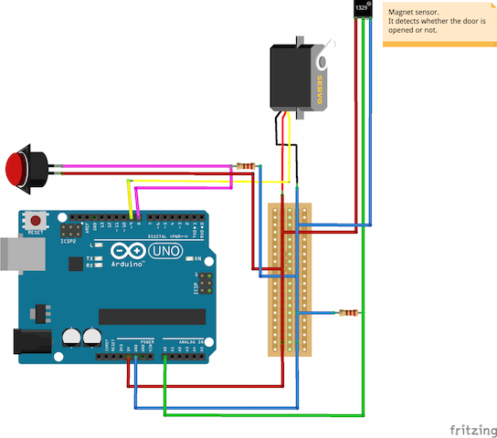

# doorknob-iot
Let's modernize your home's door with IoT!

# Components
* Arduino
  + Scketch managing servo motor, switch and interface for the server.

* Server
  + Console applications.
  + Web Applications (simple php applications).

# Requirements

* Hardwares
  + [Arduino UNO](https://www.arduino.cc/en/Main/ArduinoBoardUno)

  + [Arduino Spacers](https://www.sparkfun.com/products/10927) & [Screws](https://www.sparkfun.com/products/10453)

  + Servo motor

  + Magnet sensor

  + Resistances

  + Clay

  + Universal board, Solder and some cables.

  + [Spiral Wrap](http://www.amazon.com/Gardner-Bender-73452-2-Inch-6-Foot/dp/B00317D9QG/ref=sr_1_11?ie=UTF8&qid=1459158929&sr=8-11&keywords=Spiral+Wrap)

  + [Neodymium magnet](http://www.amazon.co.jp/dp/B00X5EJ3WO?psc=1)

  + [Switch](http://akizukidenshi.com/catalog/g/gP-04581/)

  + USB cable for connecting Server and Arduino
    + [Long USB cable (A plug to B plug)](http://www.amazon.com/AmazonBasics-USB-2-0-Cable--Male/dp/B00NH13DV2/ref=sr_1_1?s=electronics&ie=UTF8&qid=1459159336&sr=1-1&keywords=usb+cables+a+to+b)
    + Or, USB cable for Arduino + USB extension cable cable

  + [DC adapter for Arduino](http://playground.arduino.cc/Learning/WhatAdapter)

  + **TBD**

* Server
  + OS: Ubuntu related distribution.
    - Author confirmd with: Linux Mint 16 Petra (GNU/Linux 3.11.0-12-generic x86_64)

  + Least 1 USB port

* Arduino
  + Arduino UNO
  + Arduino IDE
    - Author confirmd with: Arduino 1.6.8

# Circuit

# License
This software is released under the MIT License, see [LICENSE](./LICENSE).
